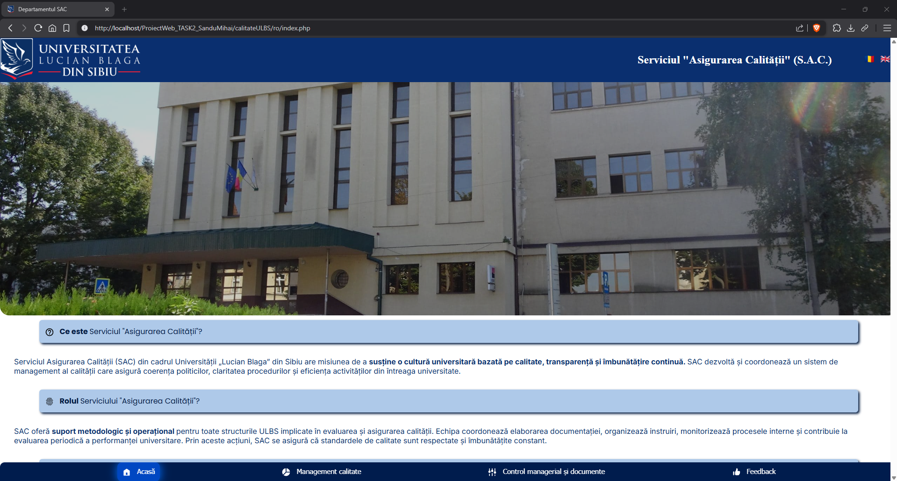
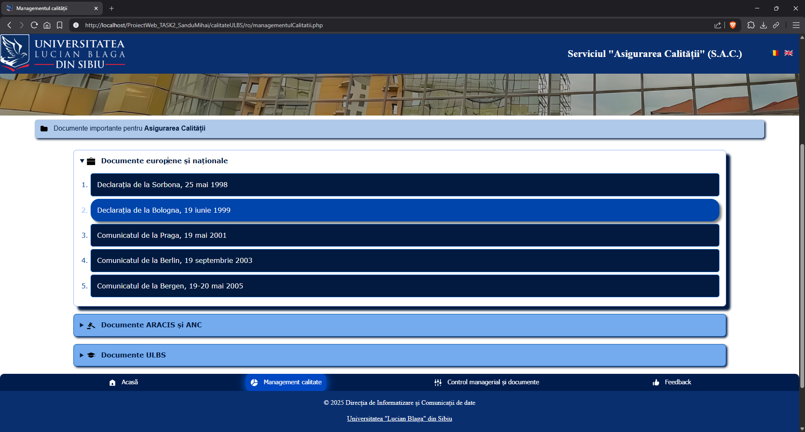
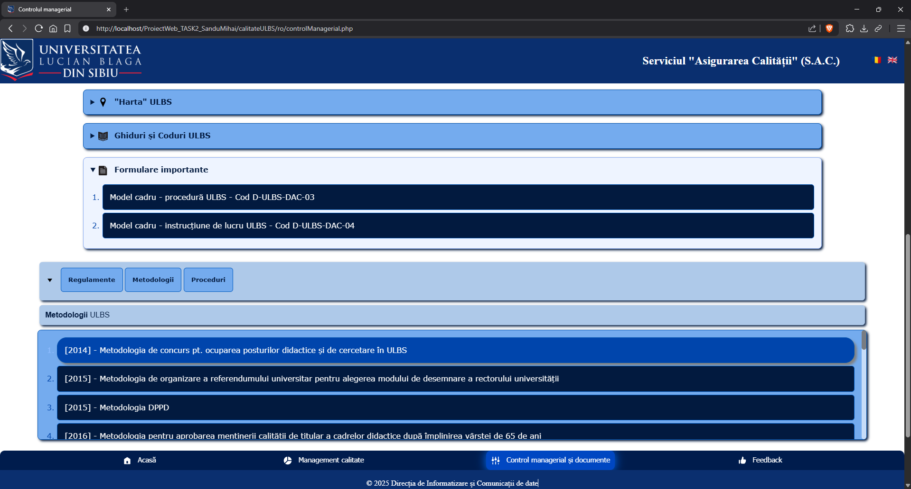
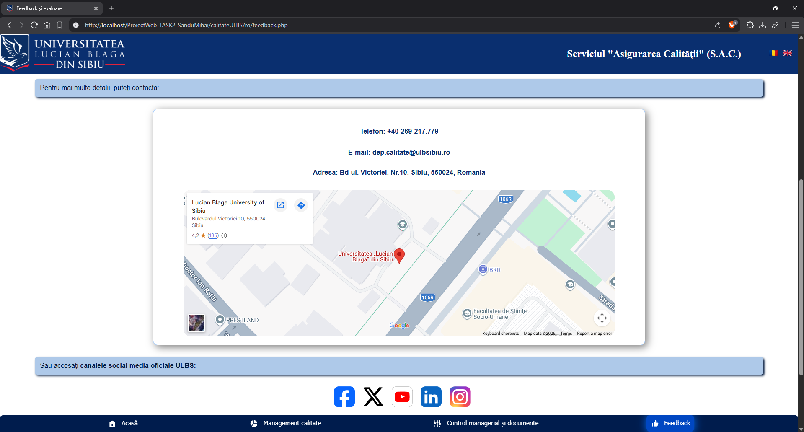
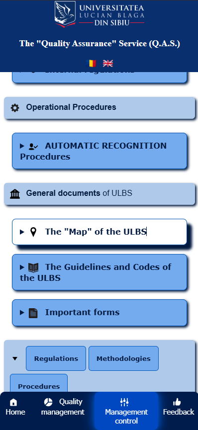
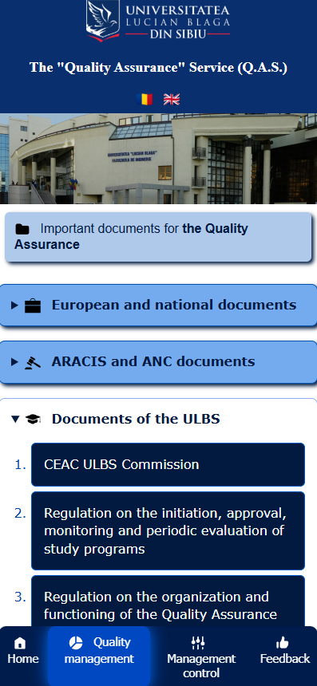

# University Website Redesign

This project represents a concept redesign of a defunct university webpage.
It was developed using HTML, CSS and PHP, and focuses on improving the layout, navigation, and usability, as well as refreshing the mobile user experience. Another key feature was the multilingual character, which provides inclusion, regardless of the language spoken by the user.

## Project File Structure:

data/ – shared PHP pages and common elements: the documents of the university
ro/ – Romanian language pages  
en/ – English language pages  
images/ – images used in the website

## Technologies Used:

- PHP
- HTML
- CSS

## Context:

This project was developed as part of an application task competition, for the web development team of the university.

## Screenshots:

